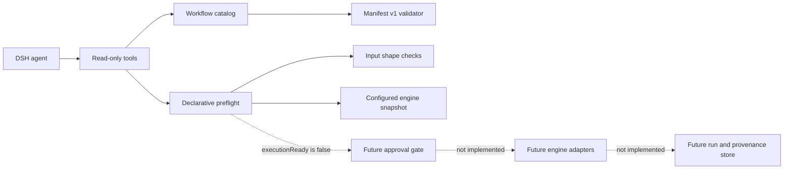

# Design and implementation status

## Executive assessment

`dsh-bio-workflows` has implemented the read-only control-plane foundation, but
it has **not implemented the main end-to-end product capability: executing and
managing a bioinformatics workflow**.

The current package can answer three questions safely:

1. Which workflow manifests are configured?
2. Is one manifest structurally valid?
3. Do supplied input values and a configured engine declaration agree with that
   manifest?

It cannot yet prove that referenced files exist, discover an installed engine,
submit a run, stream logs, cancel a run, or collect provenance and artifacts.

## Architecture boundary

The manifest is intentionally metadata-only. It contains no command, script,
entrypoint, or source checkout instruction. Preflight consumes caller-supplied
JSON values and a package configuration snapshot; it does not read the host or
start a process. This keeps catalog registration and preflight below the
execution authority boundary.

## Capability matrix

| Capability | Status | Evidence | Remaining gap |
| --- | --- | --- | --- |
| DSH bundle installation | Implemented | `dsh.bundle.patch` and `cordis.patch.yml` | Real-profile smoke test after each release |
| Manifest v1 schema | Implemented | JSON Schema plus zero-dependency runtime validator | Schema migration policy when v2 is needed |
| Workflow catalog | Implemented | Strict startup validation, unique ids, deterministic list/get | Dynamic provider registration if needed |
| Input declaration preflight | Implemented | Required, unknown, scalar type, and cardinality checks | File existence, readability, size, and checksum checks |
| Environment declaration preflight | Implemented | Availability and exact-version comparison | Trusted live engine probing |
| Execution authorization | Not implemented | `executionReady` is always `false` | Explicit approval/policy contract |
| Engine execution adapters | Not implemented | No command or adapter surface exists | Nextflow, WDL/Cromwell, and Snakemake adapters |
| Run lifecycle | Not implemented | No run id or persisted state | Submit, status, logs, cancellation, retries |
| Provenance and reports | Not implemented | No run artifacts are produced | Inputs, versions, checksums, outputs, normalized reports |

## Is the main functionality implemented?

The answer depends on which product boundary is being evaluated:

- **Foundation package:** yes. Installation metadata, manifest validation,
  catalog discovery, and declaration-only preflight are implemented and tested.
- **Usable workflow runner:** no. The package cannot execute or manage a real
  bioinformatics workflow, so the primary end-user loop is incomplete.

The project is therefore at a safe control-plane milestone, not at an execution
MVP.

## Next milestones

### 1. Trusted preflight providers

Introduce an injected provider contract instead of embedding shell calls in the
model-facing tool. Providers can implement file metadata checks and engine
version discovery under an explicit host policy. The pure validator remains the
fallback and continues to work without a provider.

Acceptance criteria:

- every live check reports its source and timestamp;
- unavailable providers produce `incomplete`, never a false `pass`;
- probes are cancellable, bounded, and cannot execute workflow payloads;
- declaration-only mode remains the default.

### 2. Execution plan and approval gate

Add an adapter-neutral execution plan that resolves a manifest into a reviewable
command, environment, mounts, and expected outputs. Planning must not submit a
run. A separate operation crosses the execution boundary only after DSH policy or
user approval.

### 3. Engine adapters and run lifecycle

Implement one adapter first, preferably Nextflow, behind the common contract.
Return an immutable run id and expose status, bounded log reads, cancellation,
and terminal outcome. Add WDL/Cromwell and Snakemake only after the lifecycle
contract is stable.

### 4. Provenance and normalized reports

Persist the manifest version, resolved inputs, engine/container versions,
checksums, timestamps, exit status, output inventory, and report links. This is
the point where a completed run becomes reproducible and auditable.

## Execution MVP definition of done

The main product functionality can be called implemented only when one supported
workflow can complete this loop:

1. discover a versioned manifest;
2. validate real inputs and the live environment;
3. render a reviewable execution plan;
4. receive explicit execution authorization;
5. submit, observe, and cancel by run id;
6. return a terminal result with provenance and output inventory.

Until all six are demonstrated in an integration test, releases should describe
themselves as control-plane or preview milestones rather than a workflow runner.

## Repository and release policy

The repository uses a mainline model with short-lived feature branches and
Conventional Commits. Every release candidate must pass `npm test`, coverage,
package export checks, `npm pack --dry-run`, and a review of public contracts.
Publishing to npm, creating a remote repository, pushing, and tagging remain
separate explicitly authorized actions.
