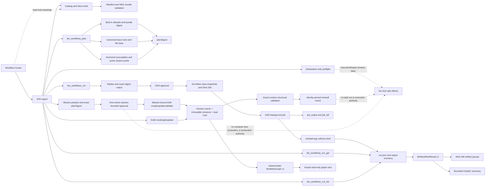

# Design and implementation status

## Executive assessment

The `0.11.0` candidate adds a bounded autonomous repair loop to the usable
AI-assisted WDL experience. One digest-bound approval creates an owner-session
Mission whose durable budgets cover only draft create, compare-and-swap update,
and exact-revision validation. Stable failure fingerprints, wall/action/failure
limits, cancellation, infrastructure failure, and runtime restart stop the loop
without automatic retry. DeepSeek Harness retains model, conversation, and
approval ownership; this plugin owns deterministic source, Mission state,
filesystem, validation, graph, and execution-policy boundaries.

The `0.7.0` `BioWorkflowResult v1`, bounded output hashing, FastQC summary
parsing, and opt-in execution MVP remain backward compatible. Built-in
`fastq-qc@1.1.0` and `1.2.0` remain the only executable workflows.

This is intentionally narrower than general WDL execution. `bam-qc`, installed
bundles, and user drafts remain non-executable. Execution is disabled by
default, uses optional DSH `subprocess` and `jobs` services, and never changes
the semantics of declaration-only `bio_workflows_preflight`.

The adapter contract and lifecycle are covered with deterministic integration
fixtures, while CI runs real `miniwdl check` for all four versioned bundles.
The retained `0.7.0` `fastq-qc@1.2.0` digest also completed a real miniwdl 1.15.0 / Docker
29.3.1 Swarm / FastQC run with confined outputs, independently checked output
digests, parsed summaries, and real `LocalJobRegistry` lifecycle states; the
sanitized record is stored under `docs/evidence/` and is bound to the reviewed
execution-adapter source hashes. The additive `0.10.0` registration and Client
entry are covered by DSH ToolRuntime, package, web API, and browser integration
tests and do not relabel that historical record.
The current Agent-loop smoke uses a deterministic model to create, read,
CAS-update, validate, and graph an exact draft,
crosses both mutation approvals, then selects the exact built-in bundle, plans
it, crosses the run approval, starts an owner-scoped long-running subprocess job, and then
proved that disposing the Agent handle removed the Agent, Session, and Job while
terminating both runner and child processes. The current sanitized
[`0.10.0` record](./evidence/dsh-bio-workflows-0.10.0-agent-loop.json) is
source-hash-bound under `docs/evidence/`.

## Architecture boundary

Manifest v1 remains metadata-only. WDL source lives in digest-verified bundles,
and Store writes have a separate approval that never grants execution. The
execution adapter accepts only an internal allowlist, snapshots approved inputs
and the already-loaded WDL into a fresh mode-`0700` run directory, and passes no
model-authored command fragments or environment names to a host shell.

## Capability matrix

| Capability | Status | Evidence | Remaining gap |
| --- | --- | --- | --- |
| DSH bundle installation | Implemented | Pack and isolated-profile smoke tests; both are CI gates | Validate the first remote CI run |
| Manifest v1 and catalog | Implemented | Strict runtime validator, JSON Schema, deterministic list/get | Migration policy when v2 is needed |
| WDL bundle and Store | Implemented foundation | Bounded reads, file SHA-256, local import closure, immutable opt-in installs | Git/TRS providers and visual Store UI |
| AI-assisted draft authoring | Implemented 0.10 core | Session-derived ownership, opaque ids, immutable full snapshots, dual CAS, model-driven DSH Agent-loop and approval smoke, structural and validator tests | Agent Skill, collaboration, test and promotion |
| Bounded autonomous WDL repair | Implemented 0.11 authoring slice | Exact plan digest, one owner-session grant, durable action/failure/wall budgets, stable fingerprints, repeated-failure circuit breaker, restart interruption, Mission/tool integration tests | Separately isolated fixture runner; no software-container success claim yet |
| Deterministic workflow graph | Implemented | Exact owner/revision/digest binding, schema validation, stable nodes/edges/source ranges, partial-graph diagnostics, parser and tool tests | Additional WDL syntax coverage and source editor navigation |
| Native Workflow Center | Implemented | Same-package Client build, official sidebar/overlay/tool slots, built-in-only bootstrap, exact execution-allowlist affordances, deep-validated graph replay, fail-closed current-Session Agent bridge, desktop/mobile and modal keyboard Playwright tests | Agent-mediated draft browsing, direct source editor, richer Store providers |
| Starter workflows | Two families, four versions | All WDL 1.0 bundles pass pinned `miniwdl 1.15.0 check`; `fastq-qc@1.2.0` has a retained real result acceptance record | Promote and verify BAM separately |
| Declaration-only preflight | Implemented and unchanged | Pure input/environment validation with `executionReady: false` | None inside this intentionally pure boundary |
| Trusted execution plan | Implemented for `fastq-qc@1.1.0` and `1.2.0` | Canonical input checks, total snapshot bytes and 1 TiB cap, file facts, executable identities, active Swarm probe, deterministic `planDigest` | Optional pre-approval full content checksums for large inputs |
| Execution authorization | Implemented | `tools/pre-execute` asks with exact bundle and plan digests; tool body replans | Policy presets beyond one-shot user approval |
| miniwdl adapter | Implemented MVP | Exact executable/version, real semantic check, fixed argv, no ambient environment inheritance, fixed Docker host and Engine ID, no host shell | Docker egress confinement and additional backends |
| Run lifecycle | Implemented | Real LocalJobRegistry success/read/kill/wait acceptance plus model-driven AgentLoop search/plan/run, approval audit, owner disposal, process-tree termination, owner fencing, bounded owner-scoped history, and fail-closed restart interruption reconciliation | Deliberate retry/resume policy; no automatic retry |
| Provenance and outputs | Result v1 implemented | Atomic `run.json`, input snapshot hashes, checksummed artifact groups, FastQC summary adapter, bounded parser and hashing limits | Directory digests and additional workflow-specific adapters |

## Is the main functionality implemented?

Yes for the intentionally bounded `0.11.0` authoring experience: an Agent can
prepare an exact Mission, cross one visible approval, create a private draft,
inspect one exact revision/file, submit multiple Mission-budgeted CAS patches,
validate each immutable revision, diagnose stable failure fingerprints, stop at
configured thresholds, and produce a truthful report. Cross-session reads are
silent, runtime restart never retries, and no draft can enter the existing
execution allowlist. A valid draft is only `ready_for_isolated_test`; no
software container was run and report success remains false.

At the code-contract and real container-execution levels, the earlier execution
MVP also remains complete for one deliberately narrow workflow. This is still
not a general production runner or full WDL IDE: canvas/source editing, draft
tests, review/promotion, collaboration, container egress isolation, and broad
workflow execution are not implemented.

The correct release description is therefore **AI-assisted revisioned WDL
authoring, deterministic visualization, and miniwdl execution MVP / preview**,
not a general-purpose autonomous software runner, production WDL runner, or
full WDL IDE.

## Security and reproducibility invariants

- Execution is off unless an operator configures disjoint absolute
  `inputRoots` and a private, operator-owned `runsRoot` directory.
- Draft mutations are off unless an operator configures a dedicated store root
  owned by the DSH process user, not writable by group/other users, with a
  replacement-protected ancestor chain. Owner and revision directory identities
  are rechecked before atomic commits and stale cleanup.
- Only `builtin:fastq-qc@1.1.0` and `builtin:fastq-qc@1.2.0` are executable,
  with exact bundle digests and a digest-pinned container image.
- Input paths are canonicalized inside allowed roots and bound to size,
  nanosecond timestamps, device, and inode in `planDigest`; they are rechecked
  after approval through no-follow file handles, copied to safe run-owned names,
  and hashed for provenance. Copying stops at the approved length, probes for
  concurrent growth, and enforces a 1 TiB total snapshot limit per run.
- miniwdl and Docker use canonical absolute executables whose owner, mode, and
  filesystem identity enter the plan and are rechecked. Their ancestors and
  the runs-root ancestors must be protected from entry replacement. Every
  invocation is a fixed argv array, never a host-shell command.
- Runner children inherit no ambient variables. The adapter supplies a fixed
  minimal environment, pins the local Docker socket, binds the Docker Engine ID
  into the plan, rejects unsafe placeholder values, disables automatic Swarm
  initialization, and requires the same active Swarm manager before approval
  and launch.
- The preview supports the Linux default Docker socket only. WDL memory
  declarations are enforced as hard container limits, and snapshot launch
  requires a 512 MiB free-space reserve beyond approved input bytes. Linux
  procfs descriptor paths bind opened inputs and executables back to approved
  canonical paths, including across intermediate-directory symlink races.
- Background work starts only inside `ctx.jobs.start()`, so missing job controls
  fail before a process is launched. Owner session checks protect job and run
  reads.
- WDL source, inputs, runner config, and provenance are written only beneath a
  fresh run directory; existing run directories are never overwritten.
- A failure or cancellation before background-job registration removes the
  fresh private run directory and its in-memory state.
- `run.json` uses an aligned 32 MiB read/write bound and historical reads depend
  only on the private runs root, not on retired input mounts.
- Captured process output and result JSON are bounded. Output paths must resolve
  back inside the miniwdl run directory before entering the inventory.
- New successful runs add `BioWorkflowResult v1` without changing historical
  provenance fields. Results are limited to 1024 artifacts, 16 GiB each, and
  64 GiB total, opened through stable confined canonical targets with no-follow
  semantics, streamed through SHA-256, and rechecked for descriptor and path
  identity. Hashing checks owner cancellation between chunks and rejects
  repeated file entities. Stable miniwdl output symlinks are accepted only while
  both the link and confined target remain unchanged.
- `fastq-qc@1.2.0` declares extracted `summary.txt` files. Parsing is limited to
  1 MiB and 512 lines per report, 4096 bytes per line, and 8 MiB / 16384 module
  lines per result; malformed UTF-8 or module states fail the run, and the host
  plugin never extracts ZIP archives.

## Next milestones

1. Package the on-demand `bio-wdl-authoring` Agent Skill after diagnostic repair
   behavior is stable.
2. Add controlled fixture testing, independent review evidence, and immutable
   promotion as separate approval boundaries before any custom execution.
3. Add an explicit optional pre-approval input-checksum policy, deployable
   container egress/isolation, storage budgets, and retention controls.
4. Promote `bam-qc` into the executable allowlist after the same real-run and
   cancellation tests, including BAM index handling if required.
5. Add revision-pinned Git/TRS Store providers and richer draft browsing.
6. Only then generalize to Cromwell/WES and editable visual round trips.

## Execution MVP definition of done

One supported workflow must complete this loop:

1. discover an exact version and bundle digest;
2. validate real inputs and the live runner environment;
3. render a reviewable, deterministic execution plan;
4. receive approval bound to that plan;
5. submit, observe, and cancel through an owner-scoped background job;
6. return terminal provenance, a confined output inventory, and normalized
   checksummed results.

All six contracts are implemented in this candidate. The real Docker-backed
success path and the model-driven Agent-loop owner-disposal path are both
recorded. Publishing remains gated on repository checks, high-risk review, and
explicit release authorization.

## Repository and release policy

The repository uses a mainline model with short-lived feature branches and
Conventional Commits. Every release candidate must pass `npm test`, coverage,
package installation, DSH profile and Agent-loop smokes, real `miniwdl check`,
and a high-risk review of subprocess, filesystem, authorization, and provenance
contracts. Publishing, pushing, tagging, and creating or merging a PR remain
separate explicitly authorized actions.
