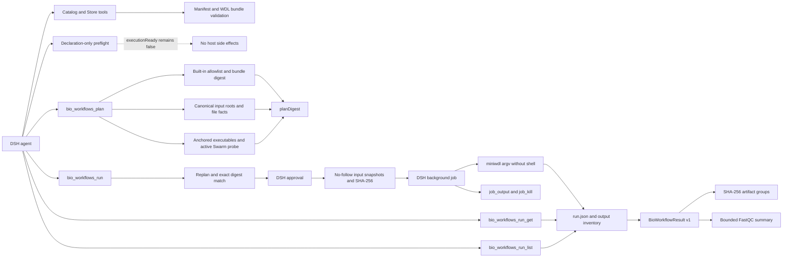

# Design and implementation status

## Executive assessment

The `0.7.0` candidate adds `BioWorkflowResult v1`, bounded output hashing, and
FastQC summary parsing to the opt-in execution MVP. Built-in
`fastq-qc@1.1.0` remains executable and backward compatible, while `1.2.0`
adds declared plain-text summaries and normalized results through miniwdl
`1.15.0`.

This is intentionally narrower than general WDL execution. `bam-qc`, installed
bundles, and user drafts remain non-executable. Execution is disabled by
default, uses optional DSH `subprocess` and `jobs` services, and never changes
the semantics of declaration-only `bio_workflows_preflight`.

The adapter contract and lifecycle are covered with deterministic integration
fixtures, while CI runs real `miniwdl check` for all four versioned bundles.
The final `fastq-qc@1.2.0` digest also completed a real miniwdl 1.15.0 / Docker
29.3.1 Swarm / FastQC run with confined outputs, independently checked output
digests, parsed summaries, and real `LocalJobRegistry` lifecycle states; the
sanitized record is stored under `docs/evidence/` and is bound to the reviewed
adapter source hashes.
The same candidate also passed a model-driven DSH Agent-loop acceptance: a
deterministic model selected the exact bundle, planned it, crossed the real
approval service, started an owner-scoped long-running subprocess job, and then
proved that disposing the Agent handle removed the Agent, Session, and Job while
terminating both runner and child processes. That separate sanitized record is
also source-hash-bound under `docs/evidence/`.

## Architecture boundary

Manifest v1 remains metadata-only. WDL source lives in digest-verified bundles,
and Store writes have a separate approval that never grants execution. The
execution adapter accepts only an internal allowlist, snapshots approved inputs
and the already-loaded WDL into a fresh mode-`0700` run directory, and passes no
model-authored command fragments or environment names to a host shell.

## Capability matrix

| Capability | Status | Evidence | Remaining gap |
| --- | --- | --- | --- |
| DSH bundle installation | Implemented | Pack and isolated-profile smoke tests; both are CI gates | Validate the first remote CI run |
| Manifest v1 and catalog | Implemented | Strict runtime validator, JSON Schema, deterministic list/get | Migration policy when v2 is needed |
| WDL bundle and Store | Implemented foundation | Bounded reads, file SHA-256, local import closure, immutable opt-in installs | Git/TRS providers and visual Store UI |
| Starter workflows | Two families, four versions | All WDL 1.0 bundles pass pinned `miniwdl 1.15.0 check`; `fastq-qc@1.2.0` has a retained real result acceptance record | Promote and verify BAM separately |
| Declaration-only preflight | Implemented and unchanged | Pure input/environment validation with `executionReady: false` | None inside this intentionally pure boundary |
| Trusted execution plan | Implemented for `fastq-qc@1.1.0` and `1.2.0` | Canonical input checks, total snapshot bytes and 1 TiB cap, file facts, executable identities, active Swarm probe, deterministic `planDigest` | Optional pre-approval full content checksums for large inputs |
| Execution authorization | Implemented | `tools/pre-execute` asks with exact bundle and plan digests; tool body replans | Policy presets beyond one-shot user approval |
| miniwdl adapter | Implemented MVP | Exact executable/version, real semantic check, fixed argv, no ambient environment inheritance, fixed Docker host and Engine ID, no host shell | Docker egress confinement and additional backends |
| Run lifecycle | Implemented | Real LocalJobRegistry success/read/kill/wait acceptance plus model-driven AgentLoop search/plan/run, approval audit, owner disposal, process-tree termination, owner fencing, bounded owner-scoped history, and fail-closed restart interruption reconciliation | Deliberate retry/resume policy; no automatic retry |
| Provenance and outputs | Result v1 implemented | Atomic `run.json`, input snapshot hashes, checksummed artifact groups, FastQC summary adapter, bounded parser and hashing limits | Directory digests and additional workflow-specific adapters |

## Is the main functionality implemented?

At the code-contract and real container-execution levels, yes for one
deliberately narrow workflow: the six steps of the execution MVP are present,
tested, and a successful FastQC completion is retained as evidence. This is
still not a general production runner: plans disclose that approval does not
precompute full input-content hashes and container egress isolation is not
enforced. Both the real Docker-backed workflow path and the model-driven DSH
Agent-loop/owner-disposal path now have retained acceptance evidence.

The correct release description is therefore **miniwdl execution MVP / preview**,
not a general-purpose or production WDL runner.

## Security and reproducibility invariants

- Execution is off unless an operator configures disjoint absolute
  `inputRoots` and a private, operator-owned `runsRoot` directory.
- Only `builtin:fastq-qc@1.1.0` and `builtin:fastq-qc@1.2.0` are executable,
  with exact bundle digests and a digest-pinned container image.
- Input paths are canonicalized inside allowed roots and bound to size,
  nanosecond timestamps, device, and inode in `planDigest`; they are rechecked
  after approval through no-follow file handles, copied to safe run-owned names,
  and hashed for provenance. Copying stops at the approved length, probes for
  concurrent growth, and enforces a 1 TiB total snapshot limit per run.
- miniwdl and Docker use canonical absolute executables whose owner, mode, and
  filesystem identity enter the plan and are rechecked. Their ancestors and
  the runs-root ancestors must be protected from entry replacement. Every
  invocation is a fixed argv array, never a host-shell command.
- Runner children inherit no ambient variables. The adapter supplies a fixed
  minimal environment, pins the local Docker socket, binds the Docker Engine ID
  into the plan, rejects unsafe placeholder values, disables automatic Swarm
  initialization, and requires the same active Swarm manager before approval
  and launch.
- The preview supports the Linux default Docker socket only. WDL memory
  declarations are enforced as hard container limits, and snapshot launch
  requires a 512 MiB free-space reserve beyond approved input bytes. Linux
  procfs descriptor paths bind opened inputs and executables back to approved
  canonical paths, including across intermediate-directory symlink races.
- Background work starts only inside `ctx.jobs.start()`, so missing job controls
  fail before a process is launched. Owner session checks protect job and run
  reads.
- WDL source, inputs, runner config, and provenance are written only beneath a
  fresh run directory; existing run directories are never overwritten.
- A failure or cancellation before background-job registration removes the
  fresh private run directory and its in-memory state.
- `run.json` uses an aligned 32 MiB read/write bound and historical reads depend
  only on the private runs root, not on retired input mounts.
- Captured process output and result JSON are bounded. Output paths must resolve
  back inside the miniwdl run directory before entering the inventory.
- New successful runs add `BioWorkflowResult v1` without changing historical
  provenance fields. Results are limited to 1024 artifacts, 16 GiB each, and
  64 GiB total, opened through stable confined canonical targets with no-follow
  semantics, streamed through SHA-256, and rechecked for descriptor and path
  identity. Stable miniwdl output symlinks are accepted only while both the link
  and confined target remain unchanged.
- `fastq-qc@1.2.0` declares extracted `summary.txt` files. Parsing is limited to
  1 MiB, 512 lines, and 4096 bytes per line; malformed UTF-8 or module states
  fail the run, and the host plugin never extracts ZIP archives.

## Next milestones

1. Add an explicit optional pre-approval input-checksum policy, deployable
   container egress/isolation, storage budgets, and retention controls.
2. Promote `bam-qc` into the executable allowlist after the same real-run and
   cancellation tests, including BAM index handling if required.
3. Add revision-bound custom-WDL drafts, deterministic validation, and
   `WorkflowGraph v1` for DeepSeek Harness native visualization.
4. Add controlled test, review, and immutable promotion before any custom draft
   can use the production execution adapter.
5. Only then generalize to Cromwell/WES and Git/TRS Store providers.

## Execution MVP definition of done

One supported workflow must complete this loop:

1. discover an exact version and bundle digest;
2. validate real inputs and the live runner environment;
3. render a reviewable, deterministic execution plan;
4. receive approval bound to that plan;
5. submit, observe, and cancel through an owner-scoped background job;
6. return terminal provenance, a confined output inventory, and normalized
   checksummed results.

All six contracts are implemented in this candidate. The real Docker-backed
success path and the model-driven Agent-loop owner-disposal path are both
recorded. Publishing remains gated on repository checks, high-risk review, and
explicit release authorization.

## Repository and release policy

The repository uses a mainline model with short-lived feature branches and
Conventional Commits. Every release candidate must pass `npm test`, coverage,
package installation, DSH profile and Agent-loop smokes, real `miniwdl check`,
and a high-risk review of subprocess, filesystem, authorization, and provenance
contracts. Publishing, pushing, tagging, and creating or merging a PR remain
separate explicitly authorized actions.
